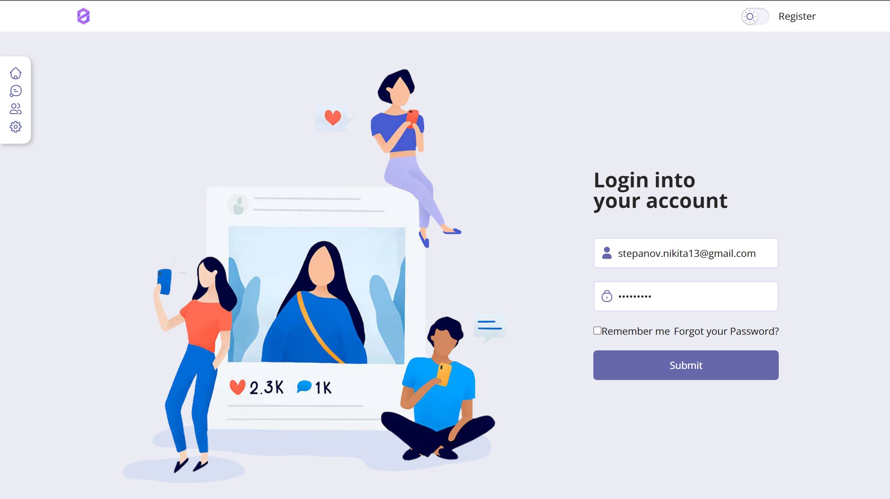
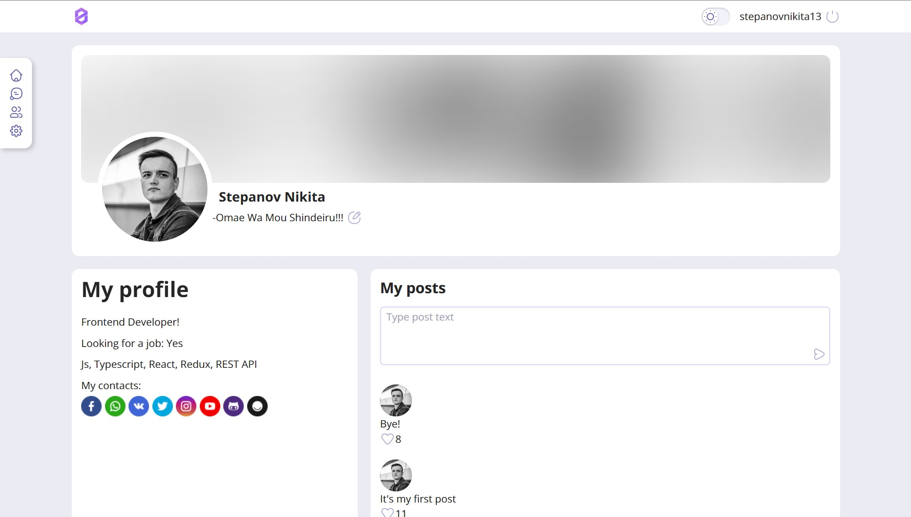
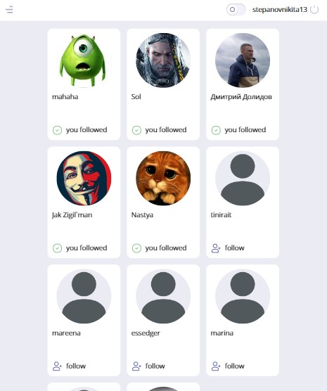
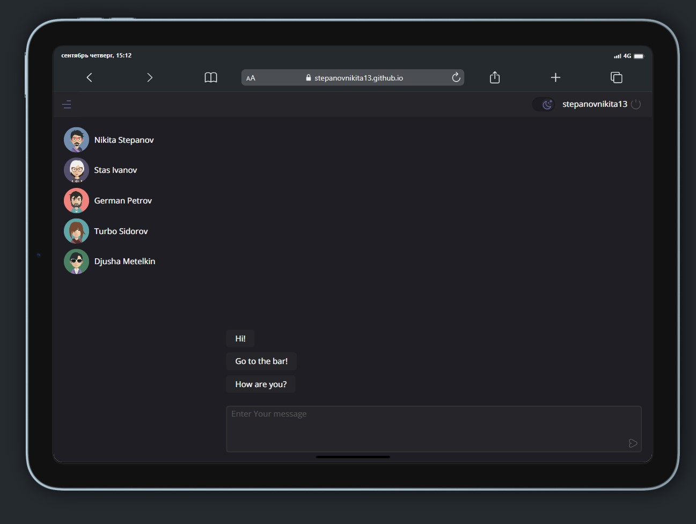
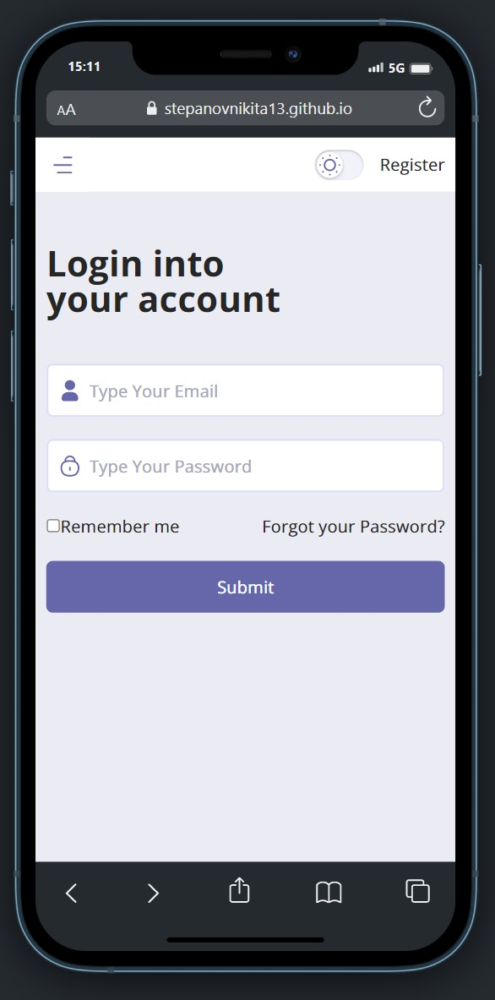

<a name="readme-top"></a>
<div align='center' >
  <h2>Social Network</h2>
  
  <p>My pet-project powered by course and lessons for learning react.</p>
  <a href="https://stepanovnikita13.github.io/react-learn">View Demo</a>
</div>
<br />
<br />
<details>
  <summary>Table of contents</summary>
  <ol>
    <li>
      <a href="#about-the-project">About The Project</a>
      <ul>
        <li><a href="#build-with">Build with</a></li>
      </ul>
    </li>
    <li>
      <a href="#getting-started">Getting Started</a>
      <ul>
        <li><a href="#installation">Installation</a></li>
      </ul>
    </li>
    <li>
   <a href="#usage">Usage</a>
   <ul>
    <li><a href="">Login</a></li>
    <li><a href="">Profile</a></li>
    <li><a href="">Users</a></li>
    <li><a href="">Dialogs</a></li>
    <li><a href="">Feauters</a></li>
   </ul>
 </li>
    <li><a href="#contacts">Contacts</a></li>
  </ol>
</details></br>

# About The Project

## Build With

<ul>
  <li>React</li>
  <li>Redux</li>
  <li>Typescript</li>
  <li>Axios</li>
  <li>Formik</li>
  <li>JSS</li>
  <li>React-dropzone</li>
</ul>
<p align="right">(<a href="#readme-top">back to top</a>)</p>

# Getting Started

The project is based on <a href="https://nodejs.org/en/">`node v16.13.2`</a>\
You must also have installed
<a href="https://git-scm.com/downloads" target="_blank" ><i>Git</i></a>
for copy app.

<!-- INSTALLATION -->
## Installation

You can start the project locally. For this:

1. Open a terminal in the folder where the copy should be downloaded
2. Clone the repo

  ```sh
  git clone https://github.com/stepanovnikita13/react-learn.git
  ```

3. Install NPM packages

  ```sh
  npm install
  ```

4. And run application

  ```
  npm start
  ```

<p align="right">(<a href="#readme-top">back to top</a>)</p>

<!-- USAGE -->
# Usage
## Login

In order to start using the application, you must log in to your account. To do this, enter your email and password in the fields, and then click the submit button. If you do not have an account yet, create an account by clicking on the registration link, then repeat the steps again.
<p>
You can also sign in to a test account. To do this, enter the following data:</br>
Email: stepanov.nikita13@gmail.com</br>
Password: Sw82z3com
</p>


<br />
<br />

## Profile

After successful authorization, you will be redirected to your profile page. Here you can:
<ul>
 <li>Edit personal data with the ability to add links to your other social networks</li>
 <li>Add status</li>
 <li>Upload avatar from your device</li>
 <li>Write posts</li>
</ul>


<br />
<br />

## Users

This page displays a list of all users, you can also subscribe to any of them and go to the user profile page


<br />
<br />

## Dialogs

This page is under development, fake behavior implemented for now.

## Feauters

The web application is fully adapted for mobile devices and tablets. On this project, it was decided to apply the principles of mobile-first development.

For lovers of the dark colors, it is possible to change the theme


<br />
<br />

Good luck! :smile:

<p align="right">(<a href="#readme-top">back to top</a>)</p>

# Contacts

Stepanov Nikita - stepanov.nikita13@gmail.com

GitHub Profile: [https://github.com/stepanovnikita13](https://github.com/stepanovnikita13)
